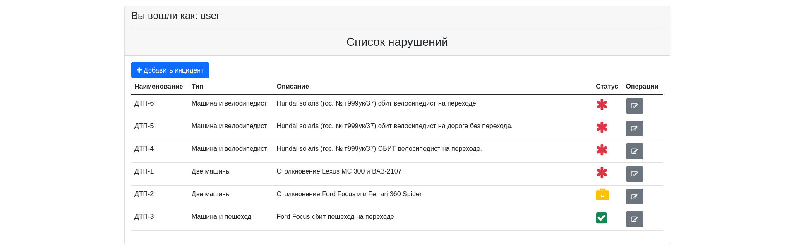
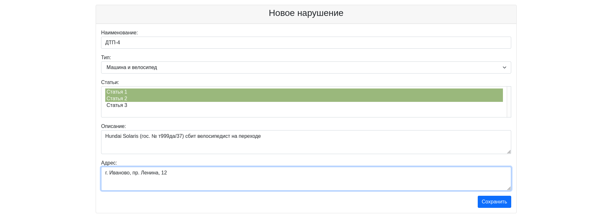
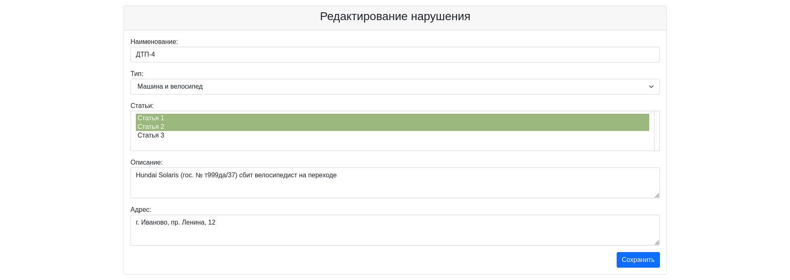
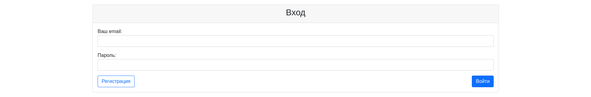

## Описание ##

Это учебный проект информационной системы для учета нарушений ПДД.

В системе существуют две роли: обычные пользователи (водители и пешеходы) и автоинспекторы.

У заявки о нарушении есть статусы: "новая", "принята", "отклонена", "завершена".

## Планируется сделать ##

Все пользователи могут выполнять поиск заявки по номеру авто. Поиск ведется в доступном пользователю диапазоне.

Обычный пользователь видит только нарушения, добавленные от своего имени. Он может добавить автонарушение, указав: 
адрес, номер машины, описание нарушения и фотографию нарушения.
Обычный пользователь также может редактировать свои новые заявки.

Инспектор видит все нарушения с возможностью их фильтрации по статусу.
Он может изменить статус заявки следующими способами:
1) с "новая" на "принята", приняв заявку в обработку.
2) с "новая" на "отклонена", отклонив заявку.
3) с "принята" на "завершена".

Во втором и третьем случаях инспектор оставляет свой комментарий в заявке, указав в нем причину отклонения или результат обработки.  

#### Технологии проекта ####

## Страницы приложения ##
#### Список нарушений ####

#### Создание нарушения ####

#### Редактирование нарушения ####

#### Форма авторизации ####

#### Форма регистрации ####

#### Форма авторизации при ошибке ####

#### Форма регистрации при ошибке ####
